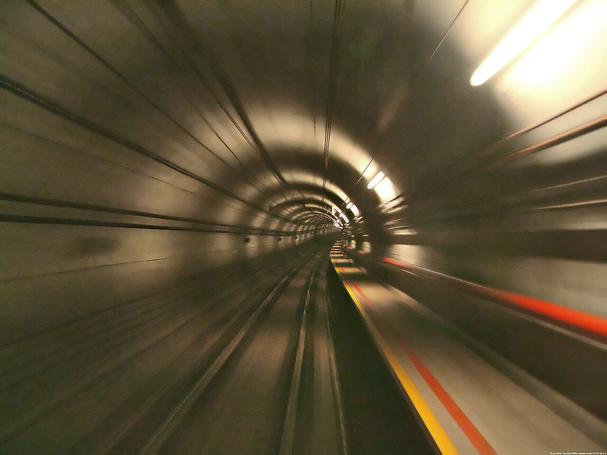

# Encabezado nivel 1  (Sección)
## Encabezado nivel 2 (Subsección)
### Encabezado nivel 3 
#### Encabezado nivel 4 
##### Encabezado nivel 5
###### Encabezado nivel 6 

## Negrita y cursiva

_texto en cursiva_

*texto en cursiva*


__texto en negrita__

**texto en negrita**

## Enlaces

[I.E.S. Juuan José Calvo Miguel](https://alojaweb.educastur.es/web/iesjuanjosecalvomiguel)

## Bloque de texto
> No hagas muchas pragmáticas; y si las hicieres, procura que sean buenas, 
> y, sobre todo, que se guarden y cumplan; que las pragmáticas que no se guardan,
> lo mismo es que si no lo fuesen;
>  antes dan a entender que el príncipe que tuvo discreción y autoridad para
>  hacerlas, no tuvo valor para hacer que se guardasen.
> 
> *Carta de Don Quijote de la Mancha a Sancho Panza, Gobernador de la Ínsula Barataria*

## Listas

### Lista sin ordenar

- Sota
   - Sota de espadas
   - Sota de oros
- Caballo  
  La figura del caballero, generalmente llamado *caballo* es una peculiaridad de
la baraja española que sustituye a la figura de la reina que aparece en la mayoría de las restantes barajas. 
Son cuatro:
   - Caballo de oros
   - ...

### Lista ordenada

1. Análisis
1. Diseño
1. Codificación
1. Prueba

## Ejemplo con imágenes y listas 

### Túnel local

Ventajas del túnel local

- Permite asegurar el primer tramo, que suele ser el más peligroso
- Para el servidor, las peticiones vienen desde el proxy, no desde la
máquina local. Esto es de utilidad 

    - Si se trata de un servicio vinculado a la IP del cliente, 
    - Para evitar cortafuegos, censura, etc
    - Burlar restricciones en la red del cliente

- El tráfico viaja cifrado en la red de la máquina local,
el administrador de esa red pierde todo control sobre él

    - El administrador de la red local puede solucionar este
    problema prohibiendo todo tráfico cifrado, y con ello los túneles 




### Túnel remoto

Con un túnel remoto, también llamado _túnel inverso_, podemos traer a la
máquina local las conexiones a cierto puerto del proxy.
Esto puede tener al menos tres utilidades

1.  Proteger el servidor
2.  Distribuir servicios
3.  Acceder a servidor tras NAT, sin configurar el NAT


## Código

### Código dentro de una línea

Ejecuta la orden `ls -l`

### Bloque de código

Esto es una extensión del markdown de github, tal vez no
funcione en otras herramientas.

```python
#!/usr/bin/env python3

def main():
    return

if __name__ == "__main__":
    main()
```

## Tabla

No siempre están soportadas.

 Hora   | Lunes | Martes | Miércoles
---|-------|--------|-----
9:00 | Tal | Tal | Cual
11:00| Esto | Lo otro | Más allá